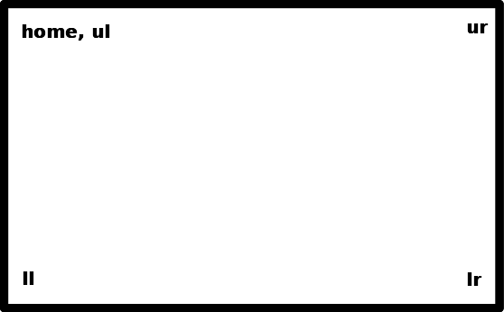

# LaserSaur_alignment
Alignment tool for LaserSaur
Both python lib and cli for manipulation of lasersaur. 
With some preprogrammed movement patterns which come in handy while 
aligning
## commanline usage
```bash
> ./lsxs.py -h
```
get help

```bash
> ./lsxs.py -R
```

reset
```bash
> /lsxs.py -l
```
move head to upper left corner, flash, move to lower left corner and flash again and wait for user to press enter

```bash
> lsxs.py -r
```
move head to upper right corner, flash, move to lower right corner and flash again and wait for user to press enter
```bash
> lsxs.py -u
```
move head to upper left corner, flash, move to upper right corner and flash again and wait for user to press enter
```bash
> lsxs.py -d
```
move head to lower left corner, flash, move to lower right corner and flash again and wait for user to press enter

```bash
> lsxs.py -c <gcode>
```
execute the gcode, or special lasergrbl code.

## Python interactive example


```python
import lsxs

instance = lsxs.Lsxs()
instance.reset()
instance.command = "G0 X100 Y100"
```
or

```python
instance.movetoxy(100, 100)
```

###flash, move, flash

```python
instance.leftvertical()
```
or

```python
instance.lowerhorizontal()
```

###coordsys

```python
instance.ll()
instance.ur()
.
.
.
etc..
```



## Disclaimer
work in progress etc..
